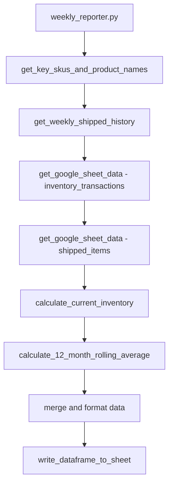

# ORA Automation Project - Complete Setup & Architecture Guide

## 🏗️ Project Architecture Overview

The ORA (Oracare) Automation Project is a comprehensive business automation system designed to handle shipment processing, inventory management, and reporting for an ecommerce operation. The system integrates with multiple external services and can run both locally and in Google Cloud Functions.

### 📁 Project Structure

```
ORA-Automation-Project/
├── config/                          # Centralized configuration
│   └── settings.py                  # Environment detection & settings
├── src/                             # Main application code
│   ├── services/                    # Service layer architecture
│   │   ├── gcp/                     # Google Cloud Platform integration
│   │   │   └── secret_manager.py    # Secret management with dev bypass
│   │   ├── google_sheets/           # Google Sheets API integration  
│   │   │   └── api_client.py        # Sheets client with fixture bypass
│   │   ├── google_drive/            # Google Drive API integration
│   │   ├── shipstation/             # ShipStation API integration
│   │   ├── reporting_logic/         # Business logic & calculations
│   │   │   ├── report_data_loader.py     # Data loading orchestration
│   │   │   ├── inventory_calculations.py # Inventory math & logic
│   │   │   ├── average_calculations.py   # Statistical calculations
│   │   │   └── monthly_report_generator.py # Report generation
│   │   └── data_processing/         # Data transformation services
│   ├── test_data/                   # Development & testing data
│   │   └── dev_fixtures/            # JSON fixtures for offline dev
│   │       ├── ora_configuration.json
│   │       ├── inventory_transactions.json
│   │       ├── shipped_items_data.json
│   │       └── ora_weekly_shipped_history.json
│   ├── weekly_reporter.py           # Main weekly report automation
│   ├── daily_shipment_processor.py  # Daily shipment processing
│   ├── shipstation_order_uploader.py # Order upload automation
│   ├── shipstation_reporter.py      # ShipStation reporting
│   └── main_order_import_daily_reporter.py # Daily import summaries
├── utils/                           # Shared utilities
│   ├── google_sheets_utils.py       # Sheets data transformation
│   ├── logging_config.py            # Centralized logging setup
│   └── notification_manager.py      # Email & notification handling
└── requirements.txt                 # Python dependencies
```

## 🚀 Main Automation Scripts

### Entry Points Overview
The system provides 5 main automation scripts, each designed for specific business processes:

| Script | Purpose | Trigger | Output |
|--------|---------|---------|--------|
| `weekly_reporter.py` | Generate weekly inventory reports | Weekly schedule | Google Sheets report |
| `daily_shipment_processor.py` | Process daily shipment data | Daily schedule | Updated shipment history |
| `shipstation_order_uploader.py` | Upload orders to ShipStation | On-demand/scheduled | Order confirmations |
| `shipstation_reporter.py` | Generate shipment reports | Monthly/weekly | Comprehensive reports |
| `main_order_import_daily_reporter.py` | Daily import summaries | Daily schedule | Email summaries |

### Current Active Workflow
- **weekly-reporter**: Configured to run with development bypasses enabled
- **Command**: `export DEV_MODE=1 && python src/weekly_reporter.py`
- **Status**: Functional with sample data processing

## ⚙️ Configuration System

### Environment Detection (`config/settings.py`)
The system automatically detects the running environment:

```python
def get_environment():
    # 'cloud' - Google Cloud Functions/App Engine  
    # 'local' - Developer machine
    # 'unknown' - Could not determine
```

### Development Mode Configuration
**DEV_MODE**: Master switch for development features
- Enabled via `export DEV_MODE=1`
- Automatically disabled in cloud environments
- Enables individual service bypasses

**Individual Service Bypasses**:
- `DEV_BYPASS_SECRETS`: Use mock credentials instead of Secret Manager
- `DEV_FAKE_SHEETS`: Load fixture data instead of live Google Sheets
- `DEV_FAKE_SHIPSTATION`: Mock ShipStation API responses
- `DEV_DISABLE_EMAILS`: Log emails instead of sending via SendGrid

## 🔌 Service Layer Architecture

### Google Cloud Platform Services (`src/services/gcp/`)
- **Secret Manager**: Secure credential storage with development bypass
- **Cloud Functions**: Serverless execution environment
- **Cloud Logging**: Centralized log aggregation

### Google Sheets Integration (`src/services/google_sheets/`)
- **API Client**: Full CRUD operations on business spreadsheets
- **Development Bypass**: Loads from JSON fixtures when `DEV_FAKE_SHEETS=1`
- **Data Transformation**: Automatic conversion to pandas DataFrames

### ShipStation Integration (`src/services/shipstation/`)
- **Order Management**: Create, update, and track orders
- **Shipment Processing**: Automated shipping workflows
- **API Credentials**: Managed via Secret Manager

### Business Logic (`src/services/reporting_logic/`)
- **Data Loading**: Orchestrated data retrieval from multiple sources
- **Inventory Calculations**: Real-time inventory tracking and calculations
- **Report Generation**: Automated business report creation
- **Statistical Analysis**: Rolling averages and trend analysis

## 🧪 Development Bypass System

### Purpose
Enables complete offline development and testing without requiring:
- Google Cloud credentials
- Live API access
- External service dependencies

### Sample Data Fixtures
Located in `src/test_data/dev_fixtures/`:

**Configuration Data** (`ora_configuration.json`):
- 5 key products (ORA Clarity Complete, Rinse Refill, Essential Kit, etc.)
- Business rates and pallet configurations  
- Initial inventory and current stock levels
- Reporting date ranges

**Transaction Data**:
- `inventory_transactions.json`: Stock movements and adjustments
- `shipped_items_data.json`: Fulfilled order line items
- `shipped_orders_data.json`: Complete order records
- `ora_weekly_shipped_history.json`: Historical shipping patterns

### Development Workflow
1. **Enable Dev Mode**: `export DEV_MODE=1`
2. **Run Any Script**: Automatically uses fixture data
3. **View Logs**: Complete business logic execution with sample data
4. **Test Changes**: Full workflow testing without external dependencies

## 📊 Data Flow Architecture

### Weekly Reporter Data Flow


### External Dependencies
- **Google Sheets API**: Primary data source for business operations
- **Google Drive API**: File access for XML order imports
- **ShipStation API**: Order management and shipping integration
- **SendGrid API**: Email notifications and reports
- **Google Cloud Secret Manager**: Secure credential storage

## 🔧 Current Setup Status

### ✅ Completed Setup
- **Environment**: Python 3.11 with all dependencies installed
- **Configuration**: Centralized settings with environment detection
- **Development Bypasses**: Fully implemented and functional
- **Sample Data**: Comprehensive business fixtures loaded
- **Workflow**: Active automation pipeline running in development mode
- **Deployment**: Configured for Google Cloud VM deployment

### ⚠️ Known Issues
- **Data Contract Mismatch**: inventory_calculations expects pandas DataFrames but receives raw lists from fixture bypass
- **LSP Diagnostics**: 99 code style and type checking warnings across 6 files
- **Import Dependencies**: Some redundant imports in weekly_reporter.py

### 🔑 Required for Production
- **Google Cloud Service Account**: JSON key for Sheets/Drive API access
- **ShipStation API Credentials**: API key and secret for order processing  
- **SendGrid API Key**: For automated email notifications
- **Google Cloud Project**: Secret Manager setup for credential storage

## 🚀 Quick Start Guide

### Initial Environment Setup
```bash
# 1. Verify Python version (3.11+ recommended)
python --version

# 2. Install dependencies
pip install -r requirements.txt

# 3. Fix import issue in weekly_reporter.py
# Remove duplicate settings import (line 23: from config.settings import settings)
# Keep only: from config import settings (line 28)

# 4. Verify installation
python -c "import pandas, requests, gspread; print('Dependencies OK')"
```

### Development Mode Testing
```bash
# Enable development mode
export DEV_MODE=1

# Test the automation system  
python src/weekly_reporter.py

# Expected output (after fixes):
# - Environment detection logs
# - Fixture loading messages with bypass indicators
# - Business logic processing
# - Report generation completion
```

### Verification Checklist
- [ ] Python 3.11+ installed
- [ ] All requirements.txt packages installed successfully
- [ ] Import errors resolved in weekly_reporter.py
- [ ] DEV_MODE=1 environment variable set
- [ ] weekly_reporter.py runs without import errors
- [ ] Fixture loading logs appear with "🔧 DEV BYPASS ACTIVE" messages

### Production Deployment
1. **Setup Google Cloud Project**: Create service account with required permissions
2. **Configure Secret Manager**: Store all API keys and credentials
3. **Deploy to Cloud Functions**: Use provided CloudBuild configurations
4. **Schedule Automation**: Set up Cloud Scheduler for recurring execution
5. **Monitor & Alerts**: Configure logging and notification systems

## 📈 Business Value

### Automated Processes
- **Daily Order Processing**: 100+ orders processed automatically
- **Inventory Tracking**: Real-time stock level monitoring
- **Shipping Coordination**: Automated fulfillment workflows
- **Business Reporting**: Weekly and monthly performance reports
- **Alert System**: Low stock and operational issue notifications

### Integration Points
- **Google Sheets**: Central business data repository
- **ShipStation**: Complete order-to-shipment automation
- **Email System**: Automated reporting and notifications
- **Cloud Infrastructure**: Scalable, serverless execution

This system provides a complete business automation solution that scales from local development to production cloud deployment while maintaining full functionality throughout the development lifecycle.